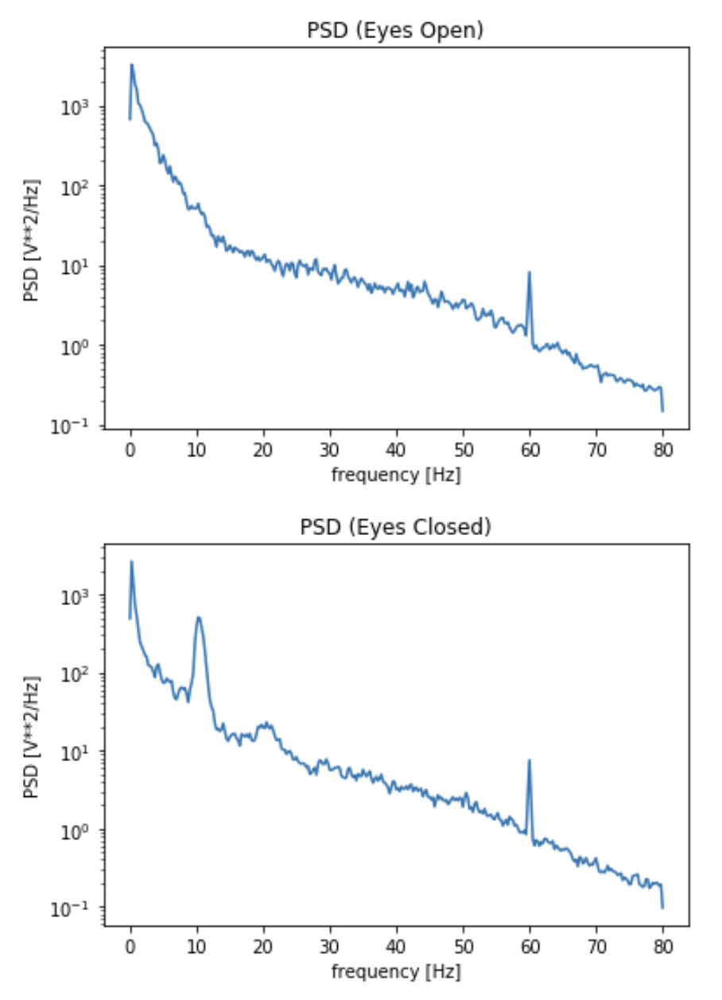
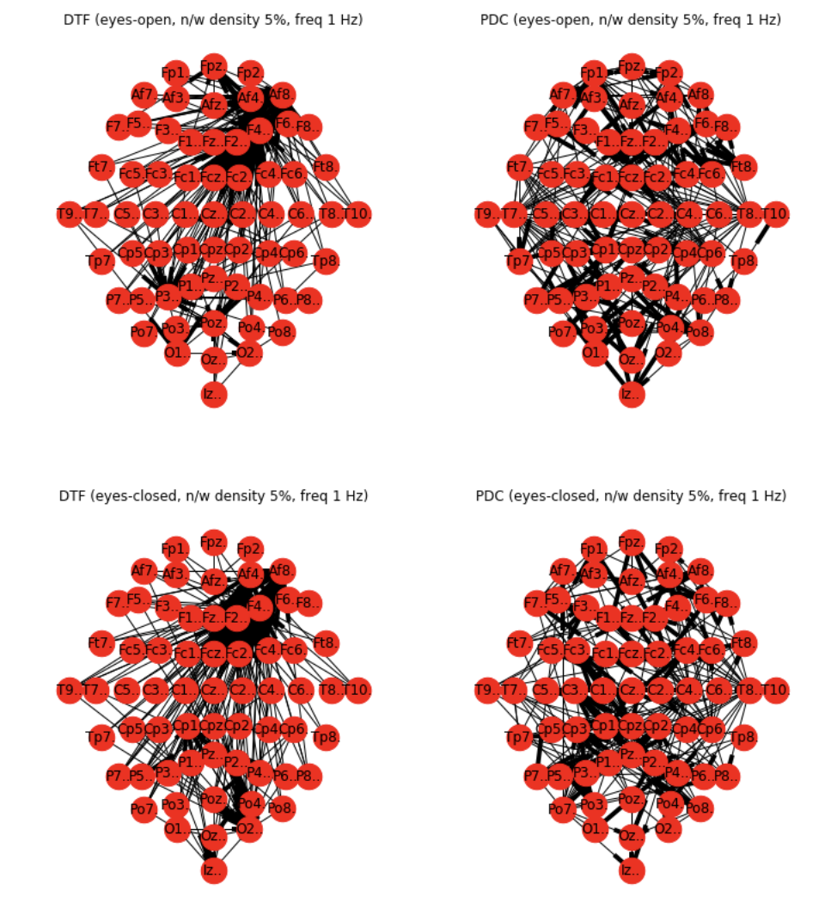
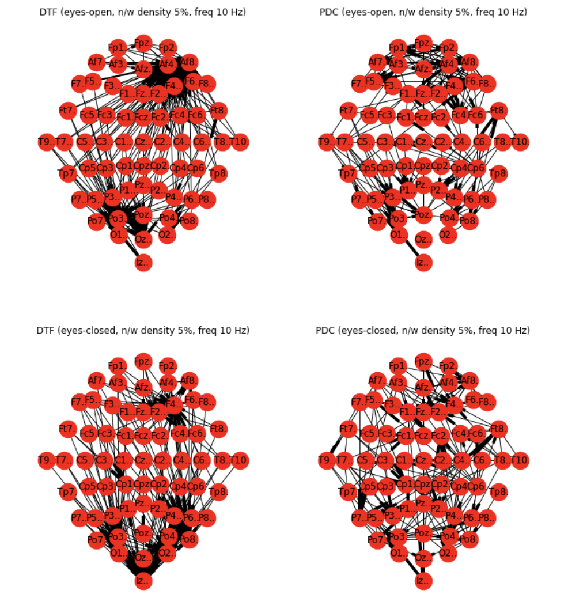

# Brain Network Activity Analysis

## Abstract

Neural oscillations are repetitive patterns of neural activity in the central nervous system. In this experiment, two datasets of EEG data for a single subject at rest in (i) **eyes-open** and (ii) **eyes-closed** conditions were analyzed. Analyzing those datasets, functional connectivity of the brain regions using two different MVAR estimators were established.

## 1. Introduction

Motor Imagery (MI) Brain-Computer Interface (BCI), MI-BCI uses the user’s endogenous brain activity in the absence of any external stimuli. MI-BCI uses, in other words, "induced" brain activity from the cortex, rather than ’evoked’ brain activity. The power of BCI resides in their ability to translate the brain activity patterns of a user into messages for an interactive application. The brain activity processed by a BCI systems is usually measured using non-invasive Electro-Encephalography (EEG). EEG is a technique that measures in real time small electrical currents reflecting brain activity with array of electrodes placed on the scalp. In the following experiment, the differences in the brain activity at rest for two states: **eyes open** and **eyes closed** were studied.

## 2. Data

The dataset was downloaded from the **PhysioNet Bank** that consisted of over 1500 EEG recordings obtained from 109 volunteers. This work is focused on subject 3 for whom two EDF files contained recordings of 64 channels of EEG signals. Here 2 set of signals were present: one with the subject at rest with their eyes open and the other set with the subject at rest with eyes closed.

## 3 Theory

Graph connectivity analysis is used to study dynamic functional connectivity (DFC) amongst spatially different brain regions. DFC analysis identifies causal relationship amongst brain regions that exhibits temporal causality in neural activations. There exist numerous estimation models in literature, linear and non- linear, bivariate and multi-variate, that quantifies such causality. Here I have used Granger causality principle based estimators i) Directed Transfer Function (DTF) and ii) Partial Directed Coherence (PDC) to perform the connectivity estimation. I have used multivariate autoregression (MVAR) model to estimate the connectivity in frequency domain and compute pairwise causality index amongst all 64 channels.

### 3.1 Multivariate Autoregressive Model

An autogregressive model assumes that a signal sample X(t) can be expressed in terms of linear sum of **p** previous values of the samples weighted by some  coefficients **A** and a random error **E(t)**.

<image src="assets/images/mvar.gif"/>

Here, **p** is called model order. The equivalent expression of the model in frequency domain is:

<image src="assets/images/mvar_spectral.gif"/>

**H(f)** is called transfer matrix of the system that represents pairwise causality relationship between the signals and their spectral characteristics.

### 3.2 Directed Transfer Function

Directed Transfer Function (DTF) is a frequency domain estimator introduced by Kaminski and Blinowska, that describes causal influence of a channel on another channel at some frequency. The equation that defines normalized version of DTF measure is.

<image src="assets/images/dtf.gif"/>

### 3.3 Partial Directed Coherence

Partial Directed Coherence is another spectral measure of directed influence between pairs of signals in a multivariate data set. PDC estimators has been shown as frequency version of the Granger causality. It is defined as

<image src="assets/images/pdc.gif"/>

## 4. Methodology

### 4.1 Frequency Selection

Power spectral density (PSD) analysis was performed on all channels to compare the strength of different frequency bands. The PSD estimation was done using Welch’s method. As from the figure below, most active signals were observed in the **delta (1-4 Hz)** band for **eyes open** state and **alpha (8-12 Hz)** for **eyes closed** state. Hence empirically identified dominant frequencies of 1 Hz and 11 Hz were used to perform connectivity analysis in further sections.

### 4.2 Statistical Test for Connectivity

In order to rule out the fact that causality may have been discovered between any two signals induced by environmental noise or by chance, statistical p-value test using shuffling method was applied. Shuffling method is based upon the generation of distribution of estimators using resampled surrogate data from original datasets. The distribution of estimators were evaluated for each pair of channels for a range of signal frequencies. Empirical value with significance level greater than 0.05 were considered as true values and rest of the values were considered false.

Thus tested estimators were collected for delta frequency band and alpha frequency band (target frequencies centered at around 1 Hz and 10 Hz). We produced connectivity graphs for varying network density at 1%, 5%, 10% and so on for both DTF and PDC connectivity estimators.

## 5. Observations

For connectivity analysis in case I (delta band) analysis, using DTF estimator we observed high degree of connectivity around right-frontal lobe in both open and closed eye state while PDC estimator approximates even distribution of connectivity across whole brain region. We do not observe considerable discrepancy in connectivity patterns between open and closed eye state for delta band. Delta wave form are associated to relaxed state of brain. Since the subject is at rest, in absence of any external stimuli in both eyes open and closed state, we see no considerable changes in terms of connectivity in two states.

In case II (alpha band), DTF estimation projects connectivity of the nodes highly localized in right-frontal lobe in **eyes open** state but in case of **eyes closed** state the connectivity is localized more in parietal and occipital regions. This form of slight perturbation in localization of connectivity was also observed using PDC estimatiors. The increased power in alpha band, as seen in PSD diagram, can be attributed to the phenomenon called ‘alpha blockage‘, the process in which alpha waves decreases and beta wave increases as a subject open their eyes.

